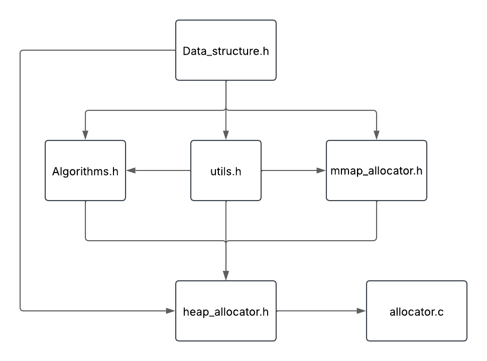
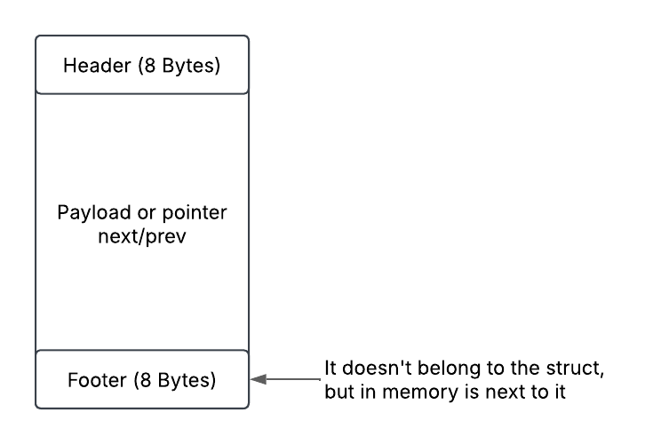
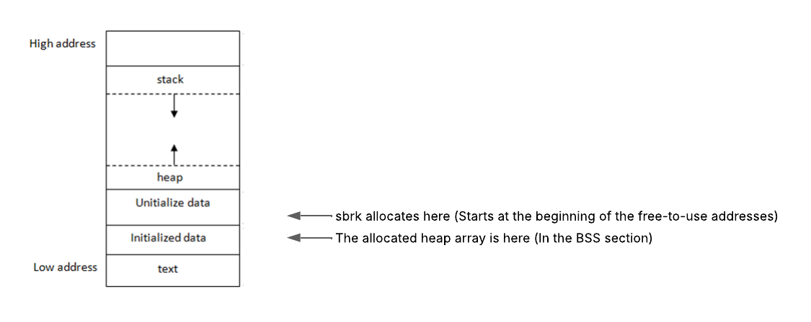
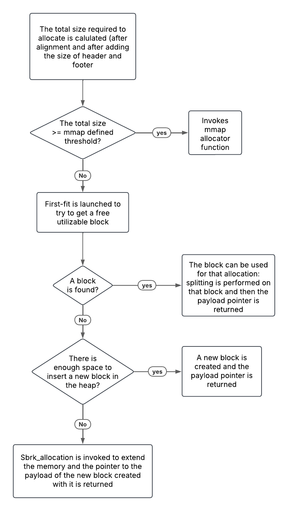

# Custom heap allocator project documentation

Author: Giuseppe Didonna

## Project description

The following program is a hybrid heap memory allocator written in the C programming language that simulates the dynamic memory management of a process in a modern operating system.

This allocator provides an interface similar to the standard C memory allocation functions and manages a private heap region in user space. Memory allocation and deallocation are handled explicitly by the allocator, while additional memory is requested from the operating system only when necessary.

The allocator supports the following operations:

- `my_malloc(size_t size)`: allocate a block of memory of the requested size
- `my_free(void *ptr)`: deallocate a previously allocated block

And manages an internal heap composed of memory blocks, each containing metadata describing its size and allocation status. Free blocks are reused to satisfy future allocation requests whenever possible.

Initially, the allocator manages a fixed-size memory region that represents the process heap. This region simulates the behavior of a traditional heap and is entirely controlled in user space.

When the available heap memory is exhausted, the allocator dynamically extends the heap by requesting additional memory from the operating system using the `sbrk` system call. The newly acquired memory is integrated into the existing heap and managed using the same allocation policies.

When an allocation requests exceed a predefined size threshold, the allocator bypasses the internal heap and instead obtains memory directly from the operating system using `mmap`.

Blocks allocated via `mmap` are managed separately from the heap and are released back to the operating system immediately using `munmap` when freed.

The allocator implements *Segregated Free Lists*, where free blocks are grouped into multiple lists based on their size ranges. Each list uses a **first-fit** allocation strategy to satisfy allocation requests.

When memory is freed, the corresponding block is marked as available and inserted back into the appropriate free list. Adjacent free blocks are merged using **coalescing** to reduce external fragmentation.

## Project structure

The project is composed of 5 header files and one C script file which is the entry point of the program with all the tests.

The header files are the following ones:

- **Algorithms.h**:
    Contains all the algorithms used by `my_malloc` and `my_free` in order to work properly. These algorithms are:
    - Align
    - Coalesce
    - First Fit
    - Split Block
    - Sbrk Allocation

- **Data_structure.h**:
    Includes all the data structures used by the main functions and algorithms in order to work properly. These data structures are:
    - Memory Block struct
    - The heap array with all the necessary pointers needed to use it
    - Segregated lists double linked list type
    - Footer and machine size word
- **Mmap_allocator.h**:
    Manages all the mmap related functions (i.e., allocation and deallocation with `mmap` and `munmap`).
- **Utils.h**:
    Includes all the functions and wrappers used around the program to make the code cleaner and more maintainable.
- **Debug_utilities.h**:
    Includes functions useful to analyze and debug the allocator
- **Heap_allocator.h**:
    Implements the body of `my_malloc` and `my_free`. It's the public interface that the user has to import in order to use the dynamic allocator.
- **Allocator.c**:
    Entry-point of the program. Tests the functions with a set of defined tests.

### Dependency diagram



## Description of the main data structures

### `typedef struct Block`

It's the base of our implementation; we use it to allocate data in the heap. Each data item is stored in a block which resides in the heap. In this implementation, a block has 5 attributes:
size, is_used flag, pointers to the previous and next block in the doubly linked list (for the segregated list), and footer. As we can see, the actual object, as defined, has only the header and the pointers for the doubly linked list. The reason is that the size and is_used flag are compressed in 
the header through a bitmask in which the last three bits are used as flags to indicate whether the block is in use and whether the block was allocated with mmap. Furthermore, the block uses a special C data structure called union:
the union allows storing two different data types in the same memory space, overlapping them. When a block is free (i.e., it doesn't store any data,  and therefore has to be placed in the segregated list), the memory zone will store the two pointers needed by the segregated list (which, remember, is a doubly linked list). When the block contains some data, it will just store the payload in that area (a pointer to the memory area where the data are stored). The size of this section is 16 bytes (8 + 8) because the compiler reserves space based on the largest data type it could store. Finally, we have the footer, which as we can see is not stored in the struct because we cannot know in advance where it will be stored in memory (given that it's after the payload). Its purpose is to make it easy to find the previous adjacent block's header in the heap. We need this information to implement coalescing in $O(1)$.



#### Struct definition:

``` C
typedef struct Block {
    size_t header; 

    union {
        struct {
            struct Block *next_free;
            struct Block *prev_free;
        };
        unsigned char payload[0]; 
    };
} Block;
```

### `unsigned char heap[HEAP_TOTAL_SIZE]`

Is an array of bytes that represents the address space of our heap. To operate on the heap, we need to know at which address it starts (heap_start), the current top (heap_top) since we need to know where the unallocated memory starts, and at which address it ends (heap_end) since we need to know when to extend the heap space through sbrk.

#### Heap support pointers

``` C
// Points to the top of the allocated portion of the heap
static unsigned char *heap_top = heap; 
//Pointer to the end of the heap array
static unsigned char *heap_end = heap + HEAP_TOTAL_SIZE;

// Pointer to the first block, which starts at the beginning of the heap
static Block* heap_start = (Block *)heap;
```

### `Block *segregatedLists[NUM_LISTS]`

It's an array of doubly linked lists that keeps track of the current free blocks. The purpose of this method is to make searching through the free blocks more efficient, to find one of the right size for allocation.

## Description of the main algorithms

### `size_t align(size_t n)`

Aligns the block of memory based on the hardware architecture. In short, it adds padding to the size of the block so that it will be a multiple of the machine word (on a x64 machine, they will be multiples of 8). By doing so, not only is aligned memory access more efficient, but we are also sure that the last 3 least significant bits are always free (since the number will be a multiple of 8).

### `Block* coalesce(Block* block)`

Is a technique that reduces memory fragmentation. Basically, the algorithm works by merging two adjacent blocks when we are freeing one of them.

- **Step 1)** Check if the adjacent blocks are valid and not in use. Besides checking if the blocks are not in use, we have to verify that the next block we are calculating is valid (i.e., it doesn't extend beyond the current heap or before it). Since the heap array is stored in the BSS section, it can happen that after the heap is extended and the program break has moved forward, some data from other BSS-allocated variables can be present between the old heap and the new space. In this case, the physical calculation of the blocks through the footer will fail if we don't properly validate the memory zone we calculated.

- **Step 2)** Generate the new merged block

### `Block* first_fit(size_t size)`

Is the policy chosen to find an already-created block in the heap when new data is allocated. Among the search policies, first-fit is the simplest one: it just returns the first valid block in the lists.

> Note: because of splitting and coalescing, blocks can "migrate" across different lists. For this reason, we should iterate through all the lists after the target one.

### `void split_block(Block *block, size_t needed_size)`

Splits the block into two different blocks, one of the exact size that the allocation needs, and the other of the remaining size. This simple technique helps avoid internal fragmentation caused by first-fit when it chooses a block much larger than what the allocation needs.

### `void* sbrk_allocation(size_t total_size)`

It's the algorithm that allows extension of our heap memory. The problem with allocating this way is that most of the time the memory reserved by sbrk will not be contiguous with our already-allocated heap. Therefore, the algorithm fills the gap by creating a new block between the last allocated block in the heap and the new address. Note that since the heap is allocated in the BSS section, the new address returned by sbrk will always be higher than the end of the heap. This happens because the sbrk system call manages a kernel-level pointer called "program break" which indicates the end of the data zone managed by the operating system. When we call the `sbrk()` syscall, the program break will always grow toward higher addresses.



## Allocation & deallocation tasks

### Allocation through `void* my_malloc(size_t size)`

`my_malloc` offers 3 ways to allocate data:
1. Standard allocation in a static heap: When the program starts, the heap offered to it has a size of 4KB. Allocation in a static heap is more efficient than using sbrk. The blocks are created in the memory space of the static heap if there aren't free and valid blocks that can be used for that allocation request; otherwise, deallocated blocks are reused and chosen through the first-fit policy.
2. Sbrk allocation: if the space in the heap runs out, the allocator uses the `sbrk` syscall to map more space in the process memory. The heap memory is then extended and can be enlarged further through another sbrk allocation.
3. Mmap allocation: if the data to allocate exceeds a certain threshold, the allocator uses the mmap syscall to handle the large block independently.



### Deallocation through `void my_free(void* ptr)`

The functioning of `my_free` is straightforward:
1. The pointer to the payload is passed by the user to the function. The block associated with that payload is obtained by the `get_block_from_payload(void* ptr)` utility function.
2. If the block is marked as mmap allocated, `mmap_free` is called.
3. The block is set to free (unused) and the footer is updated.
4. The `coalesce` function is performed to try to merge the block with its neighbors.
5. The block is inserted into the segregated lists.

## Test suit

In `allocator.c` script, tests are performed to check the correctness and expected behavior of the dynamic allocator.
The script implements a complete test suit with which the various functionalities offered by the allocator can be tested.

- The suite includes 7 different test categories that can be run individually with custom parameters or in groups with default parameters.

- With the `print_memory` utility, an overview of the current memory state can be observed to help the debugging.

**Running a Single Test**

When running a single test, its parameter can be customized:

```bash
./allocator <test_name> [param1=value] [param2=value] ...
```

**Running Multiple Tests**

When running multiple tests, only default parameters can be used.

```bash
./allocator <test_name1> <test_name2> <test_name3> ...
```

**Print Current Memory State**

When running single or multiple tests, the `verbose` option can be added to print the current dynamic memory (and mmap allocated blocks) state.

```bash
./allocator <test_name> ... verbose
```

### Available Tests

#### 1. **Choose the right allocation method: `mmap_threshold`**


---

**Description:** Verifies that allocations below, at, and above the mmap threshold are handled correctly.

**Parameters:**

- `size_below=<bytes>` (default: 65536)
- `size_at=<bytes>` (default: 131072)
- `size_above=<bytes>` (default: 262144)

**Example:**
```bash
./allocator mmap_threshold
./allocator mmap_threshold size_below=32768 size_above=524288
```

**Expected Behavior:**

- Allocations below threshold should be placed in the heap (static or sbrk-extended)
- Allocations at/above threshold ($\ge$ 128KB) should use mmap
- All three allocations should succeed and return valid pointers
- Memory should be writable (tested with memset)
- When verbose mode is enabled, mmap blocks should appear in the "MMAP ALLOCATED BLOCKS" section

**Failure Conditions:**

- **Assertion failure** if any allocation returns NULL
- **Segmentation fault** if memory cannot be written to
- **Incorrect allocation method** if blocks above threshold don't appear in mmap section (with verbose)
- **Memory exhaustion** if system cannot provide requested memory

#### 2. **Correct size block: `alignment`**

---

**Description:** Allocates blocks of different sizes and verifies proper alignment. Auto-detects the actual alignment requirement from the allocator.

**Parameters:**

- `sizes=<size1,size2,...>` (default: 1,2,3,7,8,15,16,24,64,256)

**Example:**
```bash
./allocator alignment
./allocator alignment sizes=4,10,32,57,100
```

**Expected Behavior:**

- First allocation detects the allocator's alignment (typically 8 bytes on 64-bit systems)
- All subsequent allocations should return addresses aligned to this boundary
- Each returned pointer should be divisible by the detected alignment
- Memory should be writable for all allocations
- Test prints "YES" for each aligned allocation

**Failure Conditions:**

- **Assertion failure** if any allocation returns NULL
- **Assertion failure** if any pointer address is not properly aligned (address % alignment $\not =$ 0)
- This indicates a bug in the allocator's alignment logic
- **Segmentation fault** if unaligned memory access causes hardware exceptions

#### 3. **Split algorithm and block reuse test: `split_reuse`**

---

**Description:** Allocates an initial block, frees it, then allocates a smaller block to test if the allocator can split the original block and reuse it.

**Parameters:**

- `initial=<bytes>` (default: 256)
- `realloc=<bytes>` (default: 96)

**Example:**
```bash
./allocator split_reuse
./allocator split_reuse initial=512 realloc=256
```

**Expected Behavior:**

- Initial allocation succeeds and returns a valid pointer
- After freeing, the block should be added to the appropriate segregated free list
- Second (smaller) allocation should ideally reuse the same address (block splitting)
- If addresses match: optimal reuse with splitting
- If addresses differ: allocator may have chosen a different free block (still valid)
- Both allocations should be writable

**Failure Conditions:**

- **Assertion failure** if either allocation returns NULL
- **Memory corruption** if the allocator doesn't properly split/manage block metadata
- **Segmentation fault** if freed memory is not properly marked as available

#### 4. **Test merging algorithm: `coalescing`**

---

**Description:** Allocates N contiguous blocks, frees them in different orders, and then attempts to allocate a block of the combined size to verify coalescing.

**Parameters:**

- `block_size=<bytes>` (default: 32)
- `num_blocks=<count>` (default: 5)
- `order=<0|1|2>` (0=FIFO, 1=LIFO, 2=alternating, default: 1)

**Example:**
```bash
./allocator coalescing
./allocator coalescing block_size=64 num_blocks=10 order=0
```

**Expected Behavior:**

- All N individual blocks allocate successfully in sequence
- Blocks should be physically adjacent in memory (addresses increment by block_size)
- After freeing all blocks, the coalescing algorithm should merge adjacent free blocks
- Final allocation of (block_size × num_blocks) should succeed
- Successful coalescing allows a single large contiguous allocation where N small blocks were
- Split should be expected with enough allocated blocks due to the absorption of the header and footer during the coalescing
- Memory should be writable after the merged allocation

**Failure Conditions:**

- **Assertion failure** if any individual allocation fails
- **Assertion failure** if the final merged allocation fails (indicates coalescing didn't work)
- **Fragmentation issue** if allocator cannot provide the full merged size
- With verbose mode: check free lists to see if blocks were properly merged
- LIFO order typically tests backward coalescing, FIFO tests forward coalescing

#### 5. **Efficiency memory space management: `fragmentation`**

---

**Description:** Creates fragmented memory by alternating large and small allocations, then frees in patterns to create gaps and tests handling of medium-sized allocations.

**Parameters:**

- `large=<bytes>` (default: 512)
- `small=<bytes>` (default: 64)
- `medium=<bytes>` (default: 256)
- `iterations=<count>` (default: 10)

**Example:**
```bash
./allocator fragmentation
./allocator fragmentation large=1024 small=128 iterations=5
```

**Expected Behavior:**

- Each iteration allocates: large block, small block, and medium block (medium block are immediately freed)
- After all iterations: memory contains alternating pattern of large and small blocks with gaps
- Freeing all large blocks creates non-contiguous gaps in memory
- Medium-sized allocations should succeed by fitting into freed gaps or using new space
- Tests allocator's ability to handle fragmented memory and find suitable blocks

**Failure Conditions:**

- **Assertion failure** if any allocation fails during the test
- **Memory exhaustion** if heap cannot grow to accommodate fragmented layout
- **Fragmentation deadlock** if freed gaps cannot be reused and new allocations fail
- With verbose mode: observe segregated lists to see fragmentation impact

#### 6. **Behavior on huge number of allocations: `stress_small`**

---

**Description:** Allocates many small blocks, frees a percentage of them, re-allocates the freed space, and ensures no crashes or memory errors occur.

**Parameters:**

- `size=<bytes>` (default: 32)
- `count=<number>` (default: 200)
- `free_pct=<percent>` (default: 50)

**Example:**
```bash
./allocator stress_small
./allocator stress_small count=100 free_pct=30
```

**Expected Behavior:**

- All initial allocations (count) should succeed
- Freeing operations target every other block (alternating pattern)
- Re-allocation should succeed by reusing freed blocks from segregated lists
- All memory should remain writable throughout
- Final deallocation should free all remaining blocks without errors

**Failure Conditions:**

- **Assertion failure** if any of the many allocations fails
- **Memory exhaustion** if heap cannot accommodate requested count
- **Segmentation fault** if metadata corruption occurs during intensive alloc/free cycles
- **Double-free detection** if freeing logic has bugs (may crash)
- **Memory leak detection** if blocks aren't properly tracked (not directly tested)
- With verbose mode: segregated lists should show freed blocks available for reuse

#### 7. **Testing mmap: `large_blocks`**

---

**Description:** Allocates several large blocks that trigger mmap, frees them in different orders, and verifies proper handling.

**Parameters:**

- `num=<count>` (default: 5)
- `order=<0|1|2>` (0=FIFO, 1=LIFO, 2=random, default: 1)

**Example:**
```bash
./allocator large_blocks
./allocator large_blocks num=10 order=2
```

**Expected Behavior:**

- All large allocations (256KB, 512KB, 1MB, 2MB, 512KB by default) should use mmap
- Each allocation returns a page-aligned pointer from the OS
- Blocks are tracked separately from the main heap
- Memory should be writable (tested with `memset`)
- Deallocation order tests robustness: FIFO, LIFO, or alternating pattern
- With verbose mode: blocks appear in "MMAP ALLOCATED BLOCKS" section
- After freeing: blocks should disappear from mmap tracking list

**Failure Conditions:**

- **Assertion failure** if any mmap allocation fails
- **System memory exhaustion** if OS cannot provide requested large pages
- **munmap failure** if deallocation fails (rare, indicates serious system issue)
- **Memory leak** if mmap blocks aren't properly tracked and freed
- **Segmentation fault** if mmap metadata corruption occurs
- **Virtual memory limits** if process exceeds ulimit -v restrictions

### Usage Examples

#### Single Test with Default Parameters
```bash
./allocator coalescing
```

#### Single Test with Custom Parameters
```bash
./allocator fragmentation large=1024 iterations=20
./allocator stress_small count=500 free_pct=25
./allocator coalescing block_size=256 num_blocks=15 order=2
```

#### Multiple Tests (Defaults Only)
```bash
./allocator alignment coalescing split_reuse
./allocator fragmentation stress_small
```

#### Help
```bash
./allocator -h
./allocator --help
```

### Test Output Format

Each test produces structured output:

1. **Header:** Test name and parameters used
2. **Steps:** Detailed execution steps (allocations, frees, etc.)
3. **Addresses:** Memory addresses for verification
4. **Results:** Success/failure of assertions
5. **Status:** "Test PASSED" or error message

Example output:
```
=== Test: coalescing ===
Parameters: block_size=32, num_blocks=5, order=1

Step 1: Allocating 5 blocks of 32 bytes...
  Block 0: 0x7f1234567890
  Block 1: 0x7f1234567920
  ...
```

### Default Parameters Summary

| Test | Key Default Parameters |
|------|----------------------|
| mmap_threshold | size_below=64KB, size_at=128KB, size_above=256KB |
| alignment | sizes=<1,2,3,7,8,15,16,24,64,256> |
| split_reuse | initial=256B, realloc=96B |
| coalescing | block_size=32B, num_blocks=5, order=LIFO |
| fragmentation | large=512B, small=64B, medium=256B, iter=10 |
| stress_small | size=32B, count=200, free_pct=50% |
| large_blocks | num=5, order=LIFO |

### Notes

- Parameters are case-sensitive
- When multiple tests are specified, all parameters are ignored (defaults are used)
- The test suite includes assertions; any failed assertion will cause the program to exit with an error
- Memory addresses shown in output are system-dependent and may vary between runs
- Some tests (like `large_blocks` and `mmap_threshold`) may be sensitive to system memory availability

### Bonus test (real use case test)
The allocator is tested also in a real script which implements hash table data structure. The script has been taken from a real repository on github and all the instances of `malloc` and `free` were changed with the ones of the project.
The test showed that the data structure works properly also with the custom allocator.
=== All tests passed successfully ===
```
